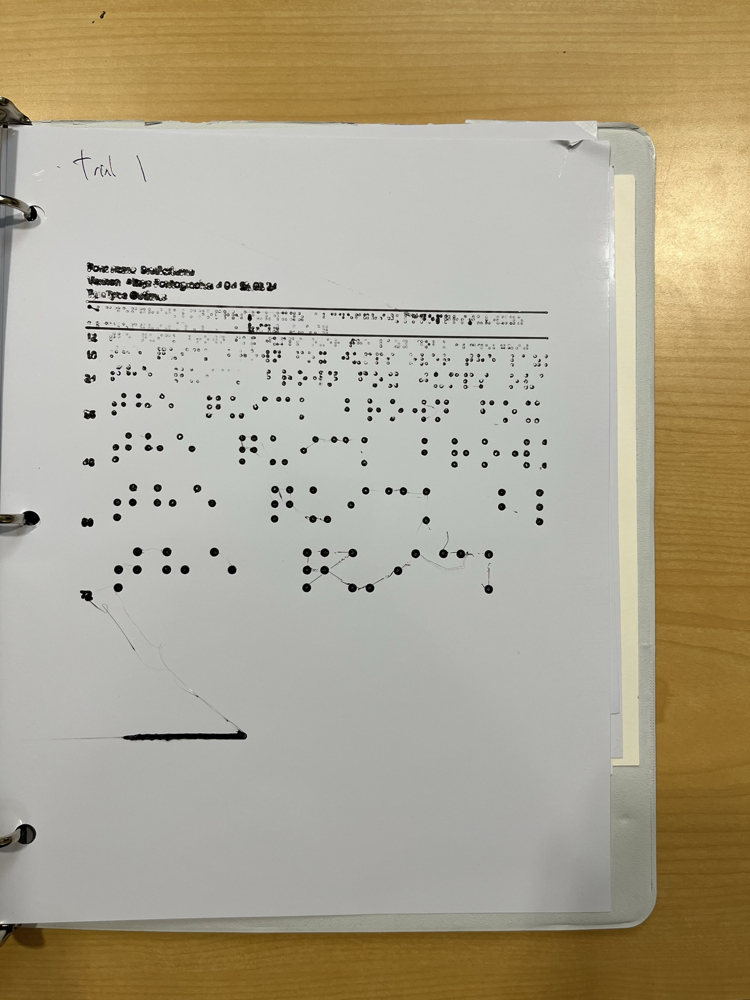
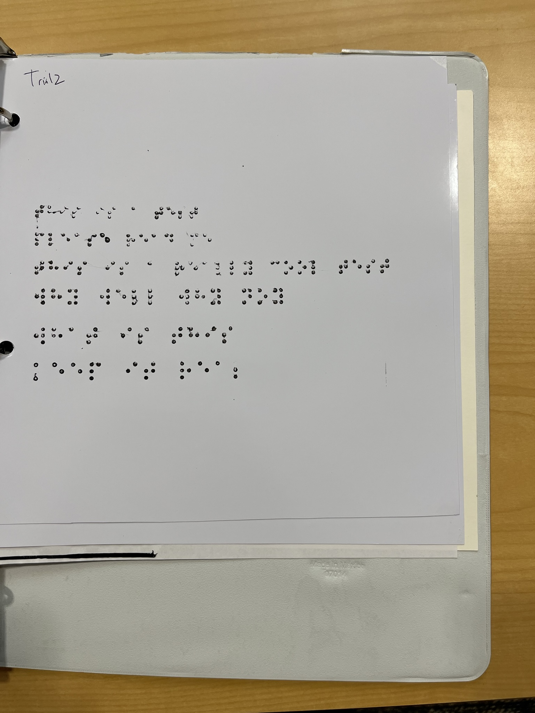
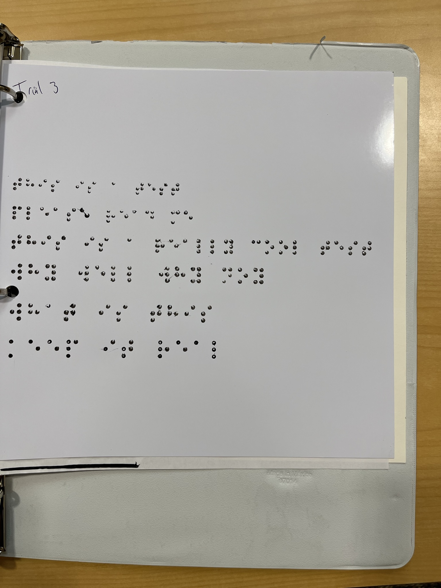
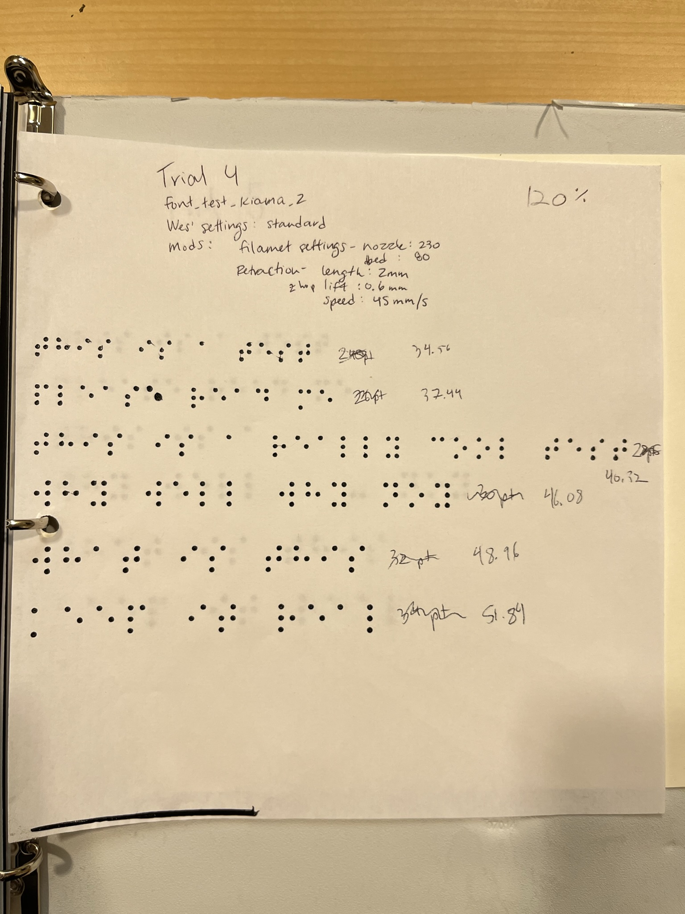
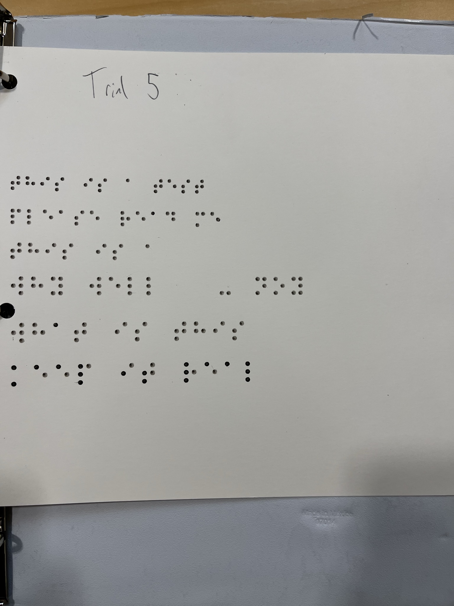

# 2/15/22
## Prusa Mk3: Braille Printing trials kiama braille

### Trial 1 Kiama  12-72 pt font test 5m

* Photo paper
* 36 looks best
* Similar settings to creality printer
### Trial 2 Kiama 24-36 (by 2pt) 4m

* Photo paper
* Similar settings to creality printer
### Trial 3 Kiama 24-36 (by 2pt) 4m

* Photo paper
* .5 to .4 extrusion width 
* 120% scale up
* 230c extruder 
* 80c print bed
* 50 mm/s print speed
* 2mm retraction length
* .6mm z-hop
* 45 mm/s retraction speed
### Trial 4 Kiama 24-36 4m

* Printer paper
* 120% up
* Sames as trial 3 but with printer paper
### Trial 5 Kiama 24-36 4m

* cardstock
* 120% up
* Need an offset for thickness of paper

## 2/15/22 Lessons Learned
* Z offset for thicker card stock is imperative or will not fill dots all the way as material gets stuck on extruder head 
* Need to do some slicer work on getting first print blob to look good
* Z offset needs plugin (see cura market place z-offset) to enable slicer setting in cura/ or can edig tgcode with: 
`G28 Z0 //home` 
`G92 Z0.1 //lower Z-axis by .1mm`
[ref](https://all3dp.com/2/z-offset-3d-printing-how-to-adjust-it/) 
* Printer paper works well for braille but will curl excessively when large lines are printed on it so maybe not best for TGs
* Verdict still out on glossy photo paper if its better than matte Wes seems to think matte will be better 
* Pet-g Dots adhere very well in all trials 
* Retraction can be adjusted more to prevent stringing 
* pet-g retraction speed is more important than amount
